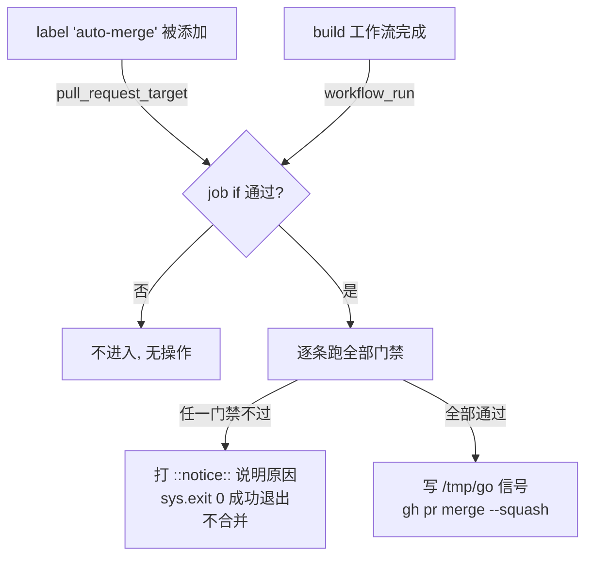

# 自动合并（auto-merge）机制说明

本文说明流水线自动合并 PR 的策略：它凭什么合、为什么会拒、被拒之后是什么状态。策略实现在 `.github/workflows/auto-merge.yml`，本文按该文件的源码撰写。拿着被拒 notice 逐条排查，见 [auto-merge-faq.md](./auto-merge-faq.md)。

> **一句话**：流水线创建的 PR，在满足**全部**门禁后由 CI 自动 squash 合并；任何一条门禁不满足都会被拒，而**被拒不是构建失败**——工作流以成功退出并打一条 `::notice::` 说明原因。

## 给谁看

- **贡献者 / 上游 agent**：想知道自己的 PR 为什么没被自动合、该怎么改。
- **维护者**：想理解这套策略为什么这样设计、边界在哪里。

## 1. 为什么策略在 CI 而不在 agent 里

流水线里的 agent 改不了 `.github/`（被 PreToolUse 护栏拦住），运行时 host 的 `gh` token 也没有 `workflow` scope。所以合并策略是流水线**证明上改不了**的那一环——把决策放在这里，就不用靠不断往护栏加正则去追着绕过跑（源码头注释 `.github/workflows/auto-merge.yml:3-6`）。

## 2. 触发方式

工作流有**两个独立入口**（`auto-merge.yml:12-27`）：

1. `pull_request_target: types: [labeled]`（`23-24`）——**打标签**是第二个、且是**必需**的入口。
2. `workflow_run: workflows: [build], types: [completed]`（`25-27`）——挂在名为 `build` 的工作流**完成**事件上。

job 级 `if`（`37-41`）决定是否进入评估：

```yaml
if: >-
  (github.event_name == 'pull_request_target' && github.event.label.name == 'auto-merge')
  || (github.event_name == 'workflow_run'
      && github.event.workflow_run.conclusion == 'success'
      && github.event.workflow_run.event == 'pull_request')
```

按代码，结论是：

- 它**确实挂在 `build` 的 `workflow_run` 上**（`25-26`）。走这条入口时，要求 `conclusion == 'success'`（`40`），即 **build 成功才评估**，且 `workflow_run.event == 'pull_request'`（`41`）。
- 但**并不是「只有 build 成功才会评估」**：`labeled` 是并列的独立入口（`23-24`, `38`）。之所以需要它，是因为 `auto-merge` 标签由**评审阶段**授予，而评审在 build **之后**才结束；只靠 `workflow_run` 的话，门禁总在标签存在之前就评估完、以「no auto-merge label」拒掉，之后再没有东西重新评估——于是什么都合不了（头注释 `13-17`）。`labeled` 就是那个「标签到位后再问一次」的重新触发点。
- 两个入口都只是「打开闸门、把问题再问一遍」——无论从哪进来，都仍要跑下面**每一条**门禁（注释 `35-36`）。所以**单靠打标签合不了任何东西**。

用 `pull_request_target` 而非 `pull_request`，是因为前者从 base 分支取工作流定义，能作用于已经开着的 PR；这里安全，因为本 job 从不 checkout PR 代码，只读元数据、调合并 API（注释 `19-22`）。



## 3. Fail-closed 总原则

每一条门禁都必须通过；一个**没有声明它拥有哪些路径**的 PR 永不会被自动合（头注释 `8-9`）。「解析从宽、判定从严」——`Auto-merge-paths:` 这行的解析故意宽松（容忍装饰），但放宽解析不放行任何错误：解析出的路径最终仍要覆盖每一个改动文件，否则照拒（注释 `122-131`）。

## 4. 逐条门禁及其存在理由

工作流共 **11 条 deny 分支**（`deny()` 调用点，源码行 `98, 99, 100, 103, 105, 107, 112, 120, 121, 157, 177`）。每条 deny 都打出形如 `::notice::auto-merge declined for #<PR号>: <原因>` 的注解并以成功退出（`deny()` 定义在 `94-96`）。下面按代码顺序列出，每条附**门禁编号**、触发条件、为什么存在。被拒时手里拿到的原因原文，见 [FAQ 排查表](./auto-merge-faq.md)。

### 来源门禁（1–3）：只合流水线自己开的分支

| # | 行 | 触发条件 | 为什么存在 |
|---|---|---|---|
| 1 | `98` | PR 来自 fork（`isCrossRepository` 为真） | 只自动合流水线自己开的分支，绝不合 fork 来的 PR——`pull_request_target` 下 fork 是不可信来源 |
| 2 | `99` | 头分支名不以 `agent/` 开头 | 只合流水线创建的 `agent/*` 分支，人手开的分支不走自动合 |
| 3 | `100` | 目标分支不是 `main` | 只允许合入 `main`，不自动合到其它目标分支 |

### opt-in 门禁（4）：必须显式授权

| # | 行 | 触发条件 | 为什么存在 |
|---|---|---|---|
| 4 | `103` | PR 的 label 里没有 `auto-merge` | 显式 opt-in：`auto-merge` 标签由评审阶段授予，没标签不合 |

### 可合并状态门禁（5–6）：GitHub 认为能干净合

| # | 行 | 触发条件 | 为什么存在 |
|---|---|---|---|
| 5 | `105` | `mergeable` 不是 `MERGEABLE`（有冲突等） | GitHub 判定不可干净合并就不合。注：`UNKNOWN` 会先在 `81-89` 轮询 6 次等 GitHub 算完，不是立即拒 |
| 6 | `106-107` | `mergeStateStatus` 属于 `DIRTY` / `BLOCKED` / `BEHIND` | 合并状态脏 / 被分支保护挡住 / 落后于 base，任一都拒 |

### check 绿门禁（7–9）：验证必须真实存在且全绿

| # | 行 | 触发条件 | 为什么存在 |
|---|---|---|---|
| 7 | `111-112` | `gh pr checks` 返回码非 0，或输出为空 | 读不到 check 状态就 fail-closed，绝不盲合 |
| 8 | `120` | 排除本 job 自身的 check 后，仍有 check 的 state 不在 `SUCCESS` / `SKIPPED` / `NEUTRAL` | 头 commit 上每一个 check（build + ci + 其它）都必须绿 |
| 9 | `121` | 排除自身后一个 check 都不剩 | 除了本 job 自己以外没有任何 check，等于没验证过，拒 |

> 第 8/9 条会排除本 job 自己的 check（`117-118`）。原因：在 `pull_request_target` 入口下本工作流自己也是 PR 上的一个 check，会观察到自己的 `IN_PROGRESS` 状态而拒合——那会在一个本来全绿的 PR 上把自己**永久死锁**（注释 `113-116`）。

### 路径所有权门禁（10–11）：并发下改同一文件的边界

| # | 行 | 触发条件 | 为什么存在 |
|---|---|---|---|
| 10 | `156-159` | 解析后 `owns` 为空——PR 正文没有可用的 `Auto-merge-paths:` 声明 | fail-closed 的所有权声明：没声明拥有哪些路径就绝不合 |
| 11 | `176-178` | 有「越界文件」——改动的文件里有任何一个不被声明的 glob 覆盖 | 越界改了没声明的文件就拒——这是并发下改同一文件的所有权边界 |

> 第 10 条同一个 `deny` 调用会依 PR 正文里**是否找到了 `Auto-merge-paths` 标记**打出两种不同文案（找到标记但后面没路径 / 完全没找到标记），FAQ 里分成两行列出。所以面向查表用户的 **notice 文案模板有 12 条**，但**代码 deny 分支是 11 条**（本文所有条数对照都以 11 条为准）。

## 5. `Auto-merge-paths:` 怎么写

### 5.1 它解决什么

多个 PR 可能并发地改动仓库。`Auto-merge-paths:` 让每个 PR **显式声明自己拥有哪些路径**；自动合并只在「PR 改动的每一个文件都落在声明范围内」时才放行。这就是并发改同一文件时的**所有权边界**——没声明、或越界改了没声明的文件，都拒（源码 `122-178`）。

### 5.2 推荐写法

在 PR 正文里写一行**纯文本**，行首就是关键字，逗号分隔多个 glob：

```
Auto-merge-paths: docs/pipeline/auto-merge.md, docs/pipeline/auto-merge-faq.md
```

解析对装饰**宽松**：`_undecorate`（`132-133`）会 `strip()` 后去掉行首的 `#>*-+ ` 与 tab、再去首尾反引号。所以这一行即使被包在反引号、列表符（`-`）或引用符（`>`）里也能识别（注释 `124-131` 记录了两个真实卡住案例：#19 反引号包裹、#16 标题 + fenced 列表）。也支持「标题形式」——单独一行 `### Auto-merge-paths`，路径写在紧随其后的行里（`145-155`）。**但推荐还是行内一行式**，最不容易出错。

### 5.3 glob 是路径感知的

编译规则见 `_glob_re`（`164-172`）：

| 写法 | 匹配 | 说明 |
|---|---|---|
| `**/` | `(?:.*/)?` | 任意层级目录前缀 |
| `**` | `.*` | 显式递归，**可跨** `/` |
| `*` | `[^/]*` | **单星不跨目录** |
| `?` | `[^/]` | 单个非分隔符字符 |

整体锚定 `\A ... \Z`，必须整串匹配（`172`）。**关键**：单 `*` 不跨 `/`，否则 `src/*` 会静默匹配到 `src/a/b/c.ts`，所有权边界形同虚设；要跨目录必须显式写 `**`（注释 `160-163`）。

### 5.4 逐文件比对

`owns` 里每个 glob 编译成正则，PR 改动的每个文件路径若不被任何一个正则覆盖就进「越界」列表（`stray`），非空即触发第 11 条 deny（`173-178`）。

## 6. 被拒不是构建失败

这一点必须清楚：**被拒 ≠ build 红叉**。代码证据：

- **拒绝走 `sys.exit(0)`**（`96`），紧跟注释 `# declining is not a build failure`。`exit(0)` = 成功退出，工作流**不**标红。
- **拒绝时先打 notice 再退出**（`95`）：`print(f"::notice::auto-merge declined for #{n}: {msg}")`——一条 `::notice::` 注解，不是 `::error::`，也不抛异常。
- **合并只在「通过」信号存在时发生**（`180`, `182-185`）：所有门禁通过后才 `open("/tmp/go","w")` 写信号，bash 层只有 `[ -f /tmp/go ]` 为真才执行 `gh pr merge`。任何一条 `deny` 都在写这个信号之前就退出，故文件不存在 → 不合并、但 job 成功退出。

一句话：**被拒 = job 以 exit 0 成功结束 + 一条 `::notice::` 说明原因 + 不合并**。你在 Actions 里看到的是绿勾加一条 notice，不是失败。被拒后的动作：读 notice 原文，对照 [FAQ 排查表](./auto-merge-faq.md) 改，然后让评审重新授予 `auto-merge` 标签（打标签会重新触发评估）。

## 附：非拒绝的 notice（不是门禁）

工作流还会打两条**非拒绝** notice，不算门禁：

- `mergeable=UNKNOWN for #<N>, attempt <i>/6 — waiting for GitHub to compute it`（`87`）——GitHub 还没算完可合并性时的轮询提示，会自动重试 6 次，不是拒绝。
- `auto-merge gates passed for #<N>; <k> file(s) within <owns>`（`179`）——全部门禁通过、即将合并的提示。
